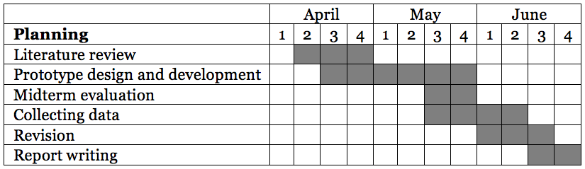

Research Internship Log Book
============================
- Title: Comparison of Energy consumption of Wi-Fi and Bluetooth Communication in Context aware Building.
- First Supervisor: Prof. Marco Aiello
- Second Supervisor: Dr. Alexander Lazovik
- Daily Supervisor: Azkario Rizky Pratama
- Duration: April - June 2016
- Location: The University of Groningen, the Netherlands.

April #2
--------
- **Thu Apr 14 2016**
	- Fixing the research proposal.
	- Learning how to code in Swift (iOS)
- **Fri Apr 15 2016**
	- Submitting the starting form.
	
April #3
--------
- **Mon Apr 18 2016**
	- Creating Git repository.
	- Creating logbook.
	- Reading literatures: Both reference papers, Apple Instruments
	- Learning how to code in iOS (Swift):https://developer.apple.com/library/ios/referencelibrary/GettingStarted/DevelopiOSAppsSwift/Lesson2.html
	
- **Tue Apr 19 15:19:41 CEST 2016**
	- Got the Mini PC for testing.
	- Installing Xubuntu in the Mini PC.
	- Got the example code of Estimote beacon.
	- Reading the example code (a little bit).

- **Wed Apr 20 13:38:58 CEST 2016**
	- Continued learning the Swift for iOS.
	- Created the first project in Swift.
	
- **Thu Apr 21 11:08:35 CEST 2016**
	- Continued learning the Swift for iOS.
	- Learned about story board in iOS (https://www.raywenderlich.com/113388/storyboards-tutorial-in-ios-9-part-1)
	
- **Fri Apr 22 15:13:21 CEST 2016**
	- Designing the storyboard of the app in the paper.
	- Learning the storyboard in iOS.
	- Started designing the storyboard.

April #4
--------
- **Mon Apr 25 11:13:02 CEST 2016** (working on Data Handling course)
	- Nothing.
- **Tue Apr 26 10:41:29 CEST 2016**
	- Continued arranging the storyboard.
	- The basic storyboard for selecting communication method (Wifi or bluetooth) is done.
- **Wed Apr 27 11:13:02 CEST 2016**
	- Kingsday.
- **Thu Apr 28 11:13:02 CEST 2016** (preparing for SciVis Resit)
	- Nothing.
- **Fri Apr 29 11:13:02 CEST 2016** (preparing for Darling)
	- Nothing.
	
May #1
------
- **Mon May  2 13:11:55 CEST 2016** (working on Data Handling course)
	- Nothing.
- **Tue May  3 13:11:55 CEST 2016** (working on Data Handling course)
	- Nothing.
- **Wed May  4 13:11:55 CEST 2016** (working on Data Handling course)
	- Nothing.
- **Thu May  5 13:11:55 CEST 2016**
	- Ascension day.
- **Fri May  6 13:11:55 CEST 2016**
	- Catching up.
	- Received communication format.
		- http://129.125.84.206:8082/bt/beacon
		- https://gist.github.com/azkario/636ddca0ff1d229df3d9667f9d905782
	- Moving on to HTTP Connection.
	
May #2
------
- **Mon May  9 14:10:31 CEST 2016**
	- Searching for bluetooth and http connection in iOS.
- **Tue May 10 10:18:56 CEST 2016**
	- Added alamofire for http communication.
	- Worked on http communication.
	- HTTP connection template found and tested.
- **Wed May 11 11:49:23 CEST 2016**
	- Continued working on http communication.
	- Completing the workflow.
	- Wi-Fi communication finished.
	- Started working for Bluetooth communication.
- **Thu May 12 11:44:45 CEST 2016**
	- Continued working on bluetooth.
		- Possible communication:
			- Using BLE Schema (server and client): Need to be tested, whether the pc support this.
			- Using direct communication schema (classic bluetooth): Does not really seem to be working.
		- Turned out that iOS devices does not fully support classic bluetooth. It only supports devices with MFi compliant (within External Accessory framework).
		- Bluetooth 4.0 can also operates in LE mode.
		- Python for bluetooth: https://github.com/IanHarvey/bluepy
	- Looked about how to read energy consumption in iOS. (https://developer.apple.com/library/ios/documentation/DeveloperTools/Conceptual/InstrumentsUserGuide/MeasuringEnergyImpact.html)
	- Bluetooth connection in iOS is inspired from this https://github.com/0x7fffffff/Core-Bluetooth-Transfer-Demo.
- **Fri May 13 11:44:45 CEST 2016** (working on Data Handling course)
	- Nothing.
- **Sat May 14 17:47:26 CEST 2016**
	- Tried to work on the Bluetooth UI.
	
May #3 (Midterm Eval)
---------------------
- **Mon May 16 10:52:39 CEST 2016** (white monday)
	- Nothing
- **Tue May 17 10:52:39 CEST 2016**
	- Setting up the PC for bluetooth server.
		- Ian Harvey's bluepy is used for interacting with BLE. (https://github.com/IanHarvey/bluepy)
	- Looking up how to hide keyboard -> using delegate pattern.
	- Bluetooth communication prototype (for the iOS) done.
	- Got the first scanning of BLE. Thanks to https://smidgeonpigeon.wordpress.com/2015/07/21/raspberry-pi-2-ble-ti-sensor-tag/
- **Wed May 18 11:02:37 CEST 2016**
	- Worked on BT app in the PC.
		- NOPASSWD is now enabled. Please **be careful**. *UPDATE*: has been disabled.
	- The connection successful, the PC can detect available LE devices and connect to it. Done by the Ian Harve's bluepy.
		- However, there is a problem when trying to subscribe.
		- The PC cannot subscribe, maybe the subscription process is not pretty clear.
		- A character that must be send to let the peripheral knows that the PC wants to subscribe is unknown.
		- The data that must be sent, possibly, is a handle and a character that inditaces a subscription. -> see the handles. or this might help https://github.com/IanHarvey/bluepy/issues/124
	- The bluepy seemed to be unstable. Later today, the code was unable to scan for a LE device. However, normal scanning using `$ sudo hcitool lescan` worked.
- **do mei 19 11:17:26 CEST 2016**
	- Continued working on BTLE communication, mainly focuses on the PC.
	- Figuring out the character to begin subscribing.
	- Extended the xubuntu hard drive size to 21 GB due to limited free space.
	- Found another library to play with BLE device using Nodejs:
		- For Central: https://github.com/sandeepmistry/noble
		- For peripheral: https://github.com/sandeepmistry/bleno
	- BTLE communication was successfully carried out using `noble` library.
- **Fri May 20 11:17:56 CEST 2016** (Working on Data Handling Course)
	- Nothing.

May #4 (Midterm Eval)
---------------------
- **Mon May 23 11:47:54 CEST 2016**
	- Continue working on bluetooth communication on PC and mobile phone.
	- Filled out a draft of mid-term evaluation form.
	- Sending the data must be careful. Watch out for **sending failure**.
	- Understanding bluetooth advertising packet: An example of how to make use of limited data size in BTLE (20 bytes)
		- http://j2abro.blogspot.nl/2014/06/understanding-bluetooth-advertising.html
	- Studied how to make use of limited data size in BLE: learn by the iBeacon.
- **Tue May 24 10:47:42 CEST 2016**
	- Focusing on working on bluetooth communication.
		- Bluetooth LE communication now **works**!
	- Tried to work on history tabs.
		- An article to learn about SQLite in iOS:
			- https://www.raywenderlich.com/123579/sqlite-tutorial-swift
	- Tried to work on hiding the keyboard. Now **working**.
- **Wed May 25 12:04:16 CEST 2016**
	- Learned SQLite in swift in iOS.
		- Other options to persist data on iOS: Realm, Core Data, Firebase.
		- Decided to use CoreData rather than SQLite.
	- Created `play-scala` project for the HTTP server.
- **Thu May 26 11:32:23 CEST 2016**
	- Added template for the report.	
	
June #4 (Final Eval)
--------------------